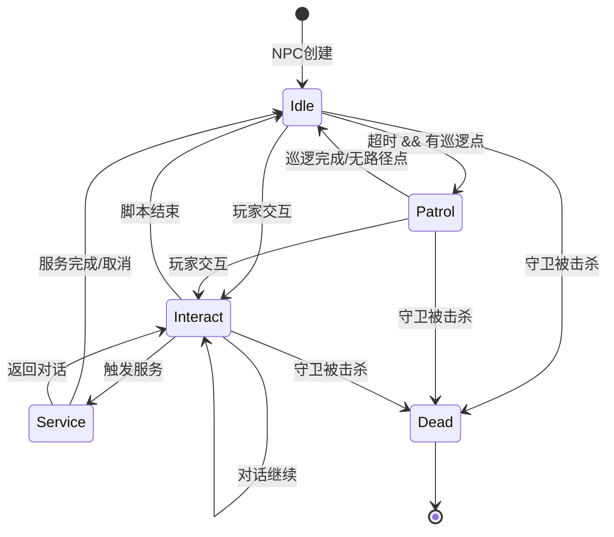

# NPC系统架构设计文档

## 1. 系统概述

### 1.1 三层架构

NPC系统采用分层架构设计，将实体管理、AI逻辑和交互处理分离：

```
┌─────────────────────────────────────────────────────────────────┐
│                      Entity Layer (实体层)                       │
│  ┌─────────────────────────────────────────────────────────┐   │
│  │  NpcEntity + ECS Components                              │   │
│  │  • NpcStateComponent (状态)                              │   │
│  │  • NpcAIComponent (AI配置)                               │   │
│  │  • NpcScriptComponent (脚本)                             │   │
│  │  • TransformComponent (位置)                             │   │
│  └─────────────────────────────────────────────────────────┘   │
├─────────────────────────────────────────────────────────────────┤
│                       AI Layer (AI层)                           │
│  ┌─────────────────────────────────────────────────────────┐   │
│  │  NpcStateMachine + NpcAISystem                          │   │
│  │  • 5状态有限状态机                                       │   │
│  │  • 巡逻路径管理                                          │   │
│  │  • 状态转换逻辑                                          │   │
│  └─────────────────────────────────────────────────────────┘   │
├─────────────────────────────────────────────────────────────────┤
│                  Interaction Layer (交互层)                      │
│  ┌─────────────────────────────────────────────────────────┐   │
│  │  ScriptEngine + InteractionHandler + EventBus           │   │
│  │  • Lua脚本执行                                           │   │
│  │  • 事件驱动交互                                          │   │
│  │  • 服务功能（商店/传送/任务）                            │   │
│  └─────────────────────────────────────────────────────────┘   │
└─────────────────────────────────────────────────────────────────┘
```

**层级职责：**

| 层级 | 职责 | 关键类 |
|------|------|--------|
| Entity | 数据存储与生命周期管理 | `NpcEntity`, `NpcManager`, ECS组件 |
| AI | 行为逻辑与状态管理 | `NpcStateMachine`, `NpcAISystem` |
| Interaction | 玩家交互与脚本执行 | `LuaScriptEngine`, `NpcInteractionHandler`, `EventBus` |

### 1.2 与Monster AI的关系

NPC系统的AI层设计参考了Monster AI的状态机模式，但针对NPC的被动交互特性进行了简化：

| 特性 | Monster AI | NPC AI |
|------|-----------|--------|
| 状态数量 | 6个 (IDLE/PATROL/CHASE/ATTACK/RETURN/DEAD) | 5个 (Idle/Patrol/Interact/Service/Dead) |
| 主动性 | 主动检测/攻击玩家 | 被动等待交互 |
| 移动行为 | 追击/逃跑/返回 | 巡逻/固定 |
| 目标管理 | 维护攻击目标 | 维护交互玩家 |
| 脚本集成 | 无 | Lua脚本驱动 |
| 复活机制 | MonsterRespawnManager | 无（NPC永久存在） |

**共享设计模式：**
- 状态计时器
- 巡逻点列表
- 速度倍率配置
- 空闲超时转换

---

## 2. 状态机设计

### 2.1 状态说明

NPC系统使用5状态有限状态机：

```cpp
enum class NpcState : uint8_t {
    Idle = 0,      // 空闲状态 - 等待交互或超时后巡逻
    Patrol = 1,    // 巡逻状态 - 在巡逻点之间移动
    Interact = 2,  // 交互状态 - 与玩家交互中，阻止移动
    Service = 3,   // 服务状态 - 提供服务（商店/传送等）
    Dead = 4       // 死亡状态 - NPC被销毁（守卫NPC）
};
```

**状态详解：**

| 状态 | 描述 | 移动 | 触发条件 | 退出条件 |
|------|------|------|----------|----------|
| **Idle** | 原地等待，可响应交互 | 否 | 初始状态/巡逻完成 | 超时或玩家交互 |
| **Patrol** | 沿路径点移动 | 是 | Idle超时且有巡逻点 | 到达终点或被交互 |
| **Interact** | 与玩家对话/菜单 | 否 | 玩家点击NPC | 脚本结束/超时 |
| **Service** | 执行服务功能 | 否 | Interact触发服务 | 服务完成/取消 |
| **Dead** | 已销毁状态 | 否 | 守卫NPC被击杀 | 不可恢复 |

### 2.2 状态转换图



### 2.3 状态机实现

核心类 `NpcStateMachine` 位于 `src/server/game/npc/npc_state_machine.h`：

```cpp
class NpcStateMachine {
public:
    // 回调类型定义
    using StateHandler = std::function<void()>;
    using StateUpdateHandler = std::function<void(float)>;
    using StateTransitionCallback = std::function<void(NpcState, NpcState)>;
    using InteractionCallback = std::function<void(entt::entity)>;

    explicit NpcStateMachine(NpcEntity& npc);

    // 核心更新
    void Update(float dt);
    void OnPlayerInteract(entt::entity player);
    void TransitionTo(NpcState new_state);

    // 状态查询
    NpcState GetState() const;
    float GetStateTimer() const;
    bool IsMovementBlocked() const;
    entt::entity GetInteractingPlayer() const;

    // 配置方法
    void SetPatrolPoints(const std::vector<NpcPatrolPoint>& points);
    void SetIdleDuration(float seconds);      // 默认 2.0s
    void SetPatrolInterval(float seconds);    // 默认 1.0s
    void SetInteractDuration(float seconds);  // 默认 0 (无超时)
    void SetServiceDuration(float seconds);   // 默认 0 (无超时)

    // 自定义处理器
    void SetStateUpdateHandler(NpcState state, StateUpdateHandler handler);
    void SetStateEnterHandler(NpcState state, StateHandler handler);
    void SetStateExitHandler(NpcState state, StateHandler handler);
    void SetOnStateChanged(StateTransitionCallback callback);
    void SetOnPlayerInteract(InteractionCallback callback);
};
```

**使用示例：**

```cpp
// 创建状态机
NpcStateMachine sm(npc_entity);

// 配置巡逻
sm.SetPatrolPoints({
    {100, 200},
    {105, 200},
    {105, 205},
    {100, 205}
});
sm.SetIdleDuration(3.0f);      // 空闲3秒后开始巡逻
sm.SetPatrolInterval(0.5f);    // 每0.5秒移动一格

// 设置状态变化回调
sm.SetOnStateChanged([](NpcState from, NpcState to) {
    spdlog::info("NPC state: {} -> {}",
                 static_cast<int>(from),
                 static_cast<int>(to));
});

// 主循环更新
void GameLoop(float dt) {
    sm.Update(dt);
}
```

---

## 3. Lua脚本系统

### 3.1 Sol2集成

系统使用 [Sol2](https://github.com/ThePhD/sol2) 库实现C++/Lua互操作，基于LuaJIT运行时：

```cpp
// src/server/game/npc/lua_script_engine.h
class LuaScriptEngine {
public:
    bool Initialize();                    // 初始化Lua VM
    void RegisterAPIs();                  // 注册C++绑定
    bool LoadScript(const std::string& path);
    size_t LoadScriptsFromDirectory(const std::string& dir);
    bool ExecuteScript(const std::string& script_id,
                       const LuaScriptContext& context);
    bool ReloadScript(const std::string& script_id);
    void ReloadAll();
    void CheckAndReloadModified();        // 热重载检查

private:
    std::unique_ptr<sol::state> lua_;
    std::unordered_map<std::string, sol::protected_function> scripts_;
    std::unordered_map<std::string, std::filesystem::file_time_type> script_mtimes_;
    int instruction_limit_ = 1'000'000;   // 指令数限制
};
```

**初始化流程：**

```cpp
LuaScriptEngine engine;
engine.Initialize();  // 创建Lua VM，加载标准库

// 加载脚本目录
size_t count = engine.LoadScriptsFromDirectory("config/npc_scripts");
spdlog::info("Loaded {} NPC scripts", count);
```

### 3.2 API参考

所有NPC API通过 `npc` 全局表提供：

#### 对话API

| 函数 | 参数 | 返回值 | 说明 |
|------|------|--------|------|
| `npc.say(player, text)` | player: context/table/id, text: string | bool | 显示NPC对话 |
| `npc.showMenu(player, options)` | player, options: table | bool | 显示选择菜单 |
| `npc.closeDialog(player)` | player | bool | 关闭对话窗口 |

#### 物品/金币API

| 函数 | 参数 | 返回值 | 说明 |
|------|------|--------|------|
| `npc.giveItem(player, item_id, count)` | player, item_id: uint32, count: int (默认1) | bool | 给予物品 |
| `npc.takeItem(player, item_id, count)` | player, item_id: uint32, count: int (默认1) | bool | 收取物品 |
| `npc.hasItem(player, item_id, count)` | player, item_id: uint32, count: int (默认1) | bool | 检查物品 |
| `npc.giveGold(player, amount)` | player, amount: int | bool | 给予金币 |
| `npc.takeGold(player, amount)` | player, amount: int | bool | 收取金币 |
| `npc.getGold(player)` | player | int/false | 获取玩家金币 |

#### 任务API

| 函数 | 参数 | 返回值 | 说明 |
|------|------|--------|------|
| `npc.startQuest(player, quest_id)` | player, quest_id: uint32 | bool | 开始任务 |
| `npc.completeQuest(player, quest_id)` | player, quest_id: uint32 | bool | 完成任务 |
| `npc.hasQuest(player, quest_id)` | player, quest_id: uint32 | bool | 检查任务状态 |

#### 服务API

| 函数 | 参数 | 返回值 | 说明 |
|------|------|--------|------|
| `npc.openShop(player, store_id)` | player, store_id: uint32 | bool | 打开商店 |
| `npc.openStorage(player)` | player | bool | 打开仓库 |
| `npc.repair(player)` | player | bool | 修理装备 |
| `npc.teleport(player, map_id, x, y)` | player, map_id, x, y: int32 | bool | 传送玩家 |

#### 玩家查询API

| 函数 | 参数 | 返回值 | 说明 |
|------|------|--------|------|
| `npc.getPlayerName(player)` | player | string/false | 获取玩家名 |
| `npc.getPlayerLevel(player)` | player | int/false | 获取玩家等级 |

#### 调试API

| 函数 | 参数 | 返回值 | 说明 |
|------|------|--------|------|
| `npc.log(message)` | message: string | bool | 输出日志 |

#### 枚举类型

```lua
-- NPC类型
NpcType.Merchant   -- 商人
NpcType.Quest      -- 任务
NpcType.Teleport   -- 传送
NpcType.Storage    -- 仓库
NpcType.Repair     -- 修理
NpcType.Guild      -- 工会
NpcType.Guard      -- 守卫

-- 脚本操作类型
NpcScriptOp.Say           -- 对话
NpcScriptOp.GiveItem      -- 给予物品
NpcScriptOp.TakeGold      -- 收取金币
NpcScriptOp.StartQuest    -- 开始任务
NpcScriptOp.Teleport      -- 传送
NpcScriptOp.OpenMerchant  -- 打开商店
NpcScriptOp.OpenStorage   -- 打开仓库
NpcScriptOp.Repair        -- 修理
NpcScriptOp.OpenGuild     -- 打开工会
NpcScriptOp.GuardAlert    -- 守卫警报
```

### 3.3 热重载机制

系统支持运行时热重载Lua脚本，无需重启服务器：

```cpp
// 检查并重载已修改的脚本
void LuaScriptEngine::CheckAndReloadModified() {
    for (const auto& [script_id, path] : script_paths_) {
        auto current_time = std::filesystem::last_write_time(path);
        if (current_time != script_mtimes_[script_id]) {
            spdlog::info("Script modified, reloading: {}", script_id);
            ReloadScript(script_id);
        }
    }
}
```

**热重载使用：**

```cpp
// 定时检查（如每5秒）
scheduler.AddTask(5000ms, [&engine]() {
    engine.CheckAndReloadModified();
});

// 手动重载单个脚本
engine.ReloadScript("merchant_default");

// 重载所有脚本
engine.ReloadAll();
```

**热重载注意事项：**
- 修改时间基于文件系统时间戳
- 重载过程中的执行请求会使用旧版本
- 语法错误会导致重载失败，保留旧版本
- 建议在低峰期进行批量重载

### 3.4 安全限制

#### 指令数限制

防止脚本无限循环导致服务器卡死：

```cpp
// 默认限制：100万条指令
constexpr int kDefaultInstructionLimit = 1'000'000;

// 通过Lua Hook实现
void LuaScriptEngine::InstructionLimitHook(lua_State* state, lua_Debug*) {
    luaL_error(state, "Lua instruction limit exceeded");
}

// 执行时设置Hook
lua_sethook(lua_->lua_state(), &InstructionLimitHook,
            LUA_MASKCOUNT, instruction_limit_);
```

#### 沙箱环境

脚本只能访问受限的标准库：

```cpp
// 只开放安全的标准库
lua_->open_libraries(
    sol::lib::base,       // 基础函数
    sol::lib::package,    // 模块加载（受限）
    sol::lib::math,       // 数学函数
    sol::lib::table,      // 表操作
    sol::lib::string,     // 字符串操作
    sol::lib::coroutine   // 协程
);

// 禁止的操作
// - os库（系统命令执行）
// - io库（文件操作）
// - debug库（调试接口）
// - loadfile/dofile（任意文件加载）
```

#### 参数验证

所有API调用都进行严格的参数验证：

```cpp
// 物品数量验证
bool is_valid_count(int value) {
    return value > 0 && value <= 10000;
}

// 坐标范围验证
constexpr int32_t kMinCoordinate = 0;
constexpr int32_t kMaxCoordinate = 65535;

// 传送参数验证
if (*map_id < 0 || *x < kMinCoordinate || *y < kMinCoordinate ||
    *x > kMaxCoordinate || *y > kMaxCoordinate) {
    return false;
}
```

---

## 4. ECS集成

### 4.1 组件设计

NPC系统使用EnTT作为ECS框架，定义了以下组件：

#### NpcStateComponent

存储NPC当前状态信息：

```cpp
// src/server/ecs/components/npc_component.h
struct NpcStateComponent {
    game::npc::NpcState current_state = game::npc::NpcState::Idle;
    game::npc::NpcState previous_state = game::npc::NpcState::Idle;
    float state_timer = 0.0f;                     // 当前状态持续时间
    entt::entity interacting_player = entt::null; // 交互中的玩家
};
```

#### NpcAIComponent

存储NPC AI配置：

```cpp
struct NpcAIComponent {
    bool enable_patrol = false;                   // 是否启用巡逻
    std::vector<legend2::Position> patrol_points; // 巡逻路径点
    uint32_t current_patrol_index = 0;            // 当前巡逻索引
    float patrol_speed = 1.0f;                    // 巡逻速度(格/秒)
    float idle_duration = 2.0f;                   // 空闲持续时间
    legend2::Position spawn_point = {0, 0};       // 出生点
};
```

#### NpcScriptComponent

存储NPC脚本关联：

```cpp
struct NpcScriptComponent {
    std::string script_id;  // Lua脚本ID（如 "merchant_default"）
    std::unordered_map<std::string, sol::object> script_data; // 脚本自定义数据
};
```

#### 组件关系图

```
┌─────────────────────────────────────────────────────────────┐
│                    NPC Entity (entt::entity)                 │
├─────────────────────────────────────────────────────────────┤
│                                                              │
│  ┌────────────────────┐  ┌────────────────────┐            │
│  │ TransformComponent │  │ NpcStateComponent  │            │
│  │ ─────────────────  │  │ ─────────────────  │            │
│  │ map_id: uint32     │  │ current_state      │            │
│  │ x, y: int32        │  │ previous_state     │            │
│  │ direction: uint8   │  │ state_timer        │            │
│  └────────────────────┘  │ interacting_player │            │
│                          └────────────────────┘            │
│                                                              │
│  ┌────────────────────┐  ┌────────────────────┐            │
│  │ NpcAIComponent     │  │ NpcScriptComponent │            │
│  │ ─────────────────  │  │ ─────────────────  │            │
│  │ enable_patrol      │  │ script_id          │            │
│  │ patrol_points[]    │  │ script_data{}      │            │
│  │ patrol_speed       │  │                    │            │
│  │ idle_duration      │  │                    │            │
│  │ spawn_point        │  │                    │            │
│  └────────────────────┘  └────────────────────┘            │
│                                                              │
└─────────────────────────────────────────────────────────────┘
```

### 4.2 系统更新流程

`NpcAISystem` 负责在每帧更新所有NPC的AI逻辑：

```cpp
// src/server/ecs/systems/npc_ai_system.h
class NpcAISystem {
public:
    void Update(entt::registry& registry, float dt);
    void OnPlayerInteract(entt::entity npc, entt::entity player);

private:
    struct NpcRuntime {
        NpcEntity npc;
        NpcStateMachine state_machine;
        bool config_initialized = false;
        // 缓存配置用于变更检测
        bool cached_patrol_enabled = false;
        float cached_idle_duration = 0.0f;
        float cached_patrol_speed = 0.0f;
        std::vector<legend2::Position> cached_patrol_points;
    };

    std::unordered_map<entt::entity, std::unique_ptr<NpcRuntime>> runtimes_;
    std::vector<std::pair<entt::entity, entt::entity>> pending_interactions_;
};
```

**更新流程图：**

```
┌─────────────────────────────────────────────────────────────────┐
│                    NpcAISystem::Update(dt)                       │
└─────────────────────────────────────────────────────────────────┘
                              │
                              ▼
┌─────────────────────────────────────────────────────────────────┐
│ 1. 处理待处理交互请求 (pending_interactions_)                    │
│    for each (npc, player) in pending_interactions_:              │
│        runtime->state_machine.OnPlayerInteract(player)           │
└─────────────────────────────────────────────────────────────────┘
                              │
                              ▼
┌─────────────────────────────────────────────────────────────────┐
│ 2. 遍历所有NPC实体                                               │
│    registry.view<NpcStateComponent, NpcAIComponent,              │
│                  NpcScriptComponent, TransformComponent>()       │
└─────────────────────────────────────────────────────────────────┘
                              │
                              ▼
┌─────────────────────────────────────────────────────────────────┐
│ 3. 获取或创建NpcRuntime                                          │
│    if (!runtimes_.contains(entity))                              │
│        runtimes_[entity] = CreateRuntime(entity)                 │
└─────────────────────────────────────────────────────────────────┘
                              │
                              ▼
┌─────────────────────────────────────────────────────────────────┐
│ 4. 同步配置变更                                                  │
│    if (ai_component changed)                                     │
│        state_machine.SetPatrolPoints(...)                        │
│        state_machine.SetIdleDuration(...)                        │
│        state_machine.SetPatrolSpeed(...)                         │
└─────────────────────────────────────────────────────────────────┘
                              │
                              ▼
┌─────────────────────────────────────────────────────────────────┐
│ 5. 更新状态机                                                    │
│    state_machine.Update(dt)                                      │
└─────────────────────────────────────────────────────────────────┘
                              │
                              ▼
┌─────────────────────────────────────────────────────────────────┐
│ 6. 同步状态到ECS组件                                             │
│    state_component.current_state = state_machine.GetState()      │
│    state_component.state_timer = state_machine.GetStateTimer()   │
│    state_component.interacting_player = ...                      │
└─────────────────────────────────────────────────────────────────┘
                              │
                              ▼
┌─────────────────────────────────────────────────────────────────┐
│ 7. 同步位置到TransformComponent                                  │
│    transform.x = npc_entity.GetX()                               │
│    transform.y = npc_entity.GetY()                               │
└─────────────────────────────────────────────────────────────────┘
                              │
                              ▼
┌─────────────────────────────────────────────────────────────────┐
│ 8. 清理已销毁实体的Runtime                                       │
│    for each runtime:                                             │
│        if (!registry.valid(entity))                              │
│            runtimes_.erase(entity)                               │
└─────────────────────────────────────────────────────────────────┘
```

---

## 5. 协议设计

### 5.1 消息ID分配

NPC系统使用 `6000-6999` 消息ID段：

```cpp
// src/common/enums.h
enum class MsgId : uint16_t {
    // ...

    // ========== NPC模块 (6000-6999) ==========
    kNpcInteractReq = 6001,   // 玩家点击NPC请求
    kNpcInteractRsp = 6002,   // NPC交互响应
    kNpcDialogShow = 6010,    // 显示NPC对话内容
    kNpcMenuSelect = 6011,    // 玩家选择对话菜单
    kNpcShopOpen = 6020,      // 打开NPC商店
    kNpcShopClose = 6021,     // 关闭NPC商店
    kNpcQuestAccept = 6030,   // 接受任务
    kNpcQuestComplete = 6031, // 完成任务

    // ...
};
```

### 5.2 消息结构

#### 交互请求 (kNpcInteractReq = 6001)

客户端 → 服务器：玩家点击NPC

```cpp
struct NpcInteractReq {
    uint64_t npc_id;      // NPC实例ID
    uint8_t action_type;  // 0=对话, 1=攻击(守卫)
};
```

#### 交互响应 (kNpcInteractRsp = 6002)

服务器 → 客户端：交互结果

```cpp
struct NpcInteractRsp {
    uint64_t npc_id;      // NPC实例ID
    uint8_t result;       // 0=成功, 1=距离过远, 2=NPC不存在, 3=NPC忙碌
    uint8_t npc_type;     // NpcType枚举值
    std::string npc_name; // NPC名称
};
```

#### 对话显示 (kNpcDialogShow = 6010)

服务器 → 客户端：显示NPC对话

```cpp
struct NpcDialogShow {
    uint64_t npc_id;
    std::string text;     // 对话内容（支持颜色代码）
    uint8_t has_menu;     // 是否有菜单选项
    std::vector<std::string> options; // 菜单选项（如有）
};
```

#### 菜单选择 (kNpcMenuSelect = 6011)

客户端 → 服务器：玩家选择菜单选项

```cpp
struct NpcMenuSelect {
    uint64_t npc_id;
    uint8_t option_index; // 选项索引（从0开始）
};
```

#### 商店打开 (kNpcShopOpen = 6020)

服务器 → 客户端：打开商店界面

```cpp
struct NpcShopOpen {
    uint64_t npc_id;
    uint32_t store_id;    // 商店配置ID
    std::vector<ShopItem> items; // 商品列表
};

struct ShopItem {
    uint32_t item_id;
    uint32_t price;
    uint16_t stock;       // 库存数量，0=无限
};
```

#### 商店关闭 (kNpcShopClose = 6021)

客户端 → 服务器：关闭商店

```cpp
struct NpcShopClose {
    uint64_t npc_id;
};
```

#### 任务接受 (kNpcQuestAccept = 6030)

服务器 → 客户端：通知任务已接受

```cpp
struct NpcQuestAccept {
    uint64_t npc_id;
    uint32_t quest_id;
    std::string quest_name;
    std::string quest_desc;
};
```

#### 任务完成 (kNpcQuestComplete = 6031)

服务器 → 客户端：通知任务完成

```cpp
struct NpcQuestComplete {
    uint64_t npc_id;
    uint32_t quest_id;
    std::vector<RewardItem> rewards;
};
```

### 5.3 客户端对接指南

#### 交互流程

```
客户端                              服务器
  │                                   │
  │ ─────── NpcInteractReq ─────────> │  玩家点击NPC
  │                                   │
  │ <────── NpcInteractRsp ───────── │  验证交互
  │                                   │
  │ <────── NpcDialogShow ─────────  │  显示对话
  │                                   │
  │ ─────── NpcMenuSelect ─────────> │  选择选项（如有菜单）
  │                                   │
  │ <────── NpcShopOpen ───────────  │  打开商店（如选择购买）
  │         或 NpcQuestAccept         │  或接受任务
  │         或更多 NpcDialogShow      │  或继续对话
  │                                   │
```

#### 距离检查

客户端应在发送交互请求前检查距离：

```cpp
constexpr int kNpcInteractDistance = 3;  // 最大交互距离（格）

bool CanInteractWithNpc(const Player& player, const Npc& npc) {
    int dx = std::abs(player.x - npc.x);
    int dy = std::abs(player.y - npc.y);
    return dx <= kNpcInteractDistance && dy <= kNpcInteractDistance;
}
```

#### UI状态管理

```cpp
class NpcDialogUI {
public:
    void OnNpcDialogShow(const NpcDialogShow& msg) {
        current_npc_id_ = msg.npc_id;
        ShowDialogText(msg.text);

        if (msg.has_menu) {
            ShowMenuOptions(msg.options);
        } else {
            ShowCloseButton();
        }
    }

    void OnMenuSelect(int index) {
        NpcMenuSelect msg;
        msg.npc_id = current_npc_id_;
        msg.option_index = index;
        network_.Send(msg);
    }

private:
    uint64_t current_npc_id_ = 0;
};
```

---

## 6. 使用示例

### 6.1 创建NPC实体

使用 `NpcManager` 创建NPC：

```cpp
#include "game/npc/npc_manager.h"
#include "game/npc/npc_types.h"

using namespace mir2::game::npc;

void CreateNpcs() {
    auto& manager = NpcManager::Instance();

    // 创建商人NPC
    NpcConfig merchant_config;
    merchant_config.template_id = 1001;
    merchant_config.name = "铁匠李";
    merchant_config.type = NpcType::kMerchant;
    merchant_config.map_id = 1;        // 比奇城
    merchant_config.x = 330;
    merchant_config.y = 330;
    merchant_config.direction = 4;     // 面向南
    merchant_config.script_id = "merchant_default";
    merchant_config.store_id = 1001;

    auto merchant = manager.CreateNpc(merchant_config);
    spdlog::info("Created merchant NPC: id={}", merchant->GetId());

    // 创建传送NPC
    NpcConfig teleport_config;
    teleport_config.template_id = 2001;
    teleport_config.name = "传送使者";
    teleport_config.type = NpcType::kTeleport;
    teleport_config.map_id = 1;
    teleport_config.x = 340;
    teleport_config.y = 340;
    teleport_config.script_id = "teleport_bichi";
    teleport_config.teleport_target = NpcTeleportTarget{2, 120, 88};

    auto teleporter = manager.CreateNpc(teleport_config);
}
```

### 6.2 编写Lua脚本

#### 简单商人脚本

```lua
-- config/npc_scripts/merchant_default.lua
-- 商人NPC默认脚本
return function(npc, player)
    npc.say(player, "欢迎光临！请看看我的商品。")
    npc.openShop(player, 1001)
end
```

#### 带菜单的对话脚本

```lua
-- config/npc_scripts/dialog_example.lua
-- 多选菜单示例
return function(npc, player)
    local choice = npc.showMenu(player, {
        "我想购买物品",
        "我想存储物品",
        "告诉我这里的故事"
    })

    if choice == 1 then
        npc.openShop(player, 1001)
    elseif choice == 2 then
        npc.openStorage(player)
    elseif choice == 3 then
        npc.say(player, "这是传说中的比奇城...")
    end
end
```

#### 任务NPC脚本

```lua
-- config/npc_scripts/quest_intro.lua
-- 任务NPC脚本
return function(npc, player)
    local player_name = npc.getPlayerName(player) or "勇士"
    local player_level = npc.getPlayerLevel(player) or 0

    -- 检查等级要求
    if player_level < 10 then
        npc.say(player, string.format(
            "%s，你还太弱小了。等你达到10级再来找我吧。",
            player_name
        ))
        return
    end

    -- 检查是否已有任务
    if npc.hasQuest(player, 2001) then
        -- 检查任务物品
        if npc.hasItem(player, 3001, 5) then
            npc.takeItem(player, 3001, 5)
            npc.completeQuest(player, 2001)
            npc.giveGold(player, 1000)
            npc.giveItem(player, 3002, 1)
            npc.say(player, "做得好！这是你的奖励。")
        else
            npc.say(player, "你还需要收集5个狼牙。")
        end
    else
        -- 分配新任务
        local choice = npc.showMenu(player, {
            "我愿意接受任务",
            "让我再考虑一下"
        })

        if choice == 1 then
            npc.startQuest(player, 2001)
            npc.say(player, "去杀死10只野狼，收集5个狼牙带回来。")
        else
            npc.say(player, "需要帮助时再来找我。")
        end
    end
end
```

#### 传送NPC脚本

```lua
-- config/npc_scripts/teleport_bichi.lua
-- 传送NPC脚本
return function(npc, player)
    local gold = npc.getGold(player)

    if not gold then
        npc.log("Failed to get player gold")
        return
    end

    local choice = npc.showMenu(player, {
        "传送到盟重 (100金币)",
        "传送到土城 (200金币)",
        "离开"
    })

    if choice == 1 then
        if gold >= 100 then
            npc.takeGold(player, 100)
            npc.say(player, "传送中...")
            npc.teleport(player, 2, 120, 88)
        else
            npc.say(player, "你的金币不足。")
        end
    elseif choice == 2 then
        if gold >= 200 then
            npc.takeGold(player, 200)
            npc.say(player, "传送中...")
            npc.teleport(player, 3, 200, 200)
        else
            npc.say(player, "你的金币不足。")
        end
    else
        npc.closeDialog(player)
    end
end
```

### 6.3 处理玩家交互

在游戏服务器中处理交互事件：

```cpp
#include "ecs/event_bus.h"
#include "ecs/events/npc_events.h"
#include "game/npc/npc_interaction_handler.h"

class GameServer {
public:
    void Initialize() {
        // 订阅NPC事件
        event_bus_.Subscribe<ecs::events::NpcDialogEvent>(
            [this](const ecs::events::NpcDialogEvent& e) {
                OnNpcDialog(e);
            }
        );

        event_bus_.Subscribe<ecs::events::NpcOpenMerchantEvent>(
            [this](const ecs::events::NpcOpenMerchantEvent& e) {
                OnNpcOpenShop(e);
            }
        );

        event_bus_.Subscribe<ecs::events::NpcTeleportEvent>(
            [this](const ecs::events::NpcTeleportEvent& e) {
                OnNpcTeleport(e);
            }
        );
    }

    void OnPlayerClickNpc(entt::entity player, uint64_t npc_id) {
        auto npc = npc_manager_.GetNpc(npc_id);
        if (!npc) {
            SendError(player, "NPC不存在");
            return;
        }

        // 检查距离
        auto& player_pos = registry_.get<TransformComponent>(player);
        if (std::abs(player_pos.x - npc->GetX()) > 3 ||
            std::abs(player_pos.y - npc->GetY()) > 3) {
            SendError(player, "距离太远");
            return;
        }

        // 触发交互
        npc_ai_system_.OnPlayerInteract(
            npc_entity_map_[npc_id], player);

        // 执行脚本
        interaction_handler_.HandleInteraction(
            player, *npc, "TALK");
    }

private:
    void OnNpcDialog(const ecs::events::NpcDialogEvent& e) {
        // 发送对话消息到客户端
        NpcDialogShow msg;
        msg.npc_id = e.npc_id;
        msg.text = e.text;
        SendToPlayer(e.player, msg);
    }

    void OnNpcOpenShop(const ecs::events::NpcOpenMerchantEvent& e) {
        // 发送商店数据到客户端
        auto items = shop_manager_.GetShopItems(e.store_id);
        NpcShopOpen msg;
        msg.npc_id = e.npc_id;
        msg.store_id = e.store_id;
        msg.items = items;
        SendToPlayer(e.player, msg);
    }

    void OnNpcTeleport(const ecs::events::NpcTeleportEvent& e) {
        // 执行传送
        teleport_system_.TeleportPlayer(
            e.player, e.map_id, e.x, e.y);
    }
};
```

---

## 7. 性能考虑

### 7.1 状态机开销

状态机更新是O(n)复杂度，n为NPC数量：

```cpp
// 性能测量
void NpcAISystem::Update(entt::registry& registry, float dt) {
    auto start = std::chrono::high_resolution_clock::now();

    auto view = registry.view<NpcStateComponent,
                              NpcAIComponent,
                              NpcScriptComponent,
                              TransformComponent>();

    for (auto entity : view) {
        // ... 更新逻辑
    }

    auto end = std::chrono::high_resolution_clock::now();
    auto duration = std::chrono::duration_cast<std::chrono::microseconds>(
        end - start);

    // 记录性能指标
    metrics_.RecordNpcUpdateTime(duration.count());
}
```

**优化建议：**

| 优化策略 | 说明 | 预期收益 |
|----------|------|----------|
| 分帧更新 | 将NPC分组，每帧只更新部分 | 降低峰值CPU |
| 休眠机制 | 远离玩家的NPC降低更新频率 | 减少30-50%更新 |
| 空间分区 | 使用四叉树管理NPC | 加速交互检测 |
| 批量同步 | 合并ECS组件写入 | 减少缓存失效 |

```cpp
// 示例：分帧更新
void NpcAISystem::Update(entt::registry& registry, float dt) {
    const int kNpcsPerFrame = 100;

    auto view = registry.view<NpcStateComponent, ...>();
    int count = 0;
    int start_index = frame_index_ * kNpcsPerFrame;

    for (auto it = view.begin(); it != view.end(); ++it) {
        if (count >= start_index && count < start_index + kNpcsPerFrame) {
            UpdateNpc(*it, dt);
        }
        count++;
    }

    frame_index_ = (frame_index_ + 1) % ((count / kNpcsPerFrame) + 1);
}
```

### 7.2 Lua调用性能

Lua脚本调用有一定开销，需要注意：

| 操作 | 预估耗时 | 说明 |
|------|----------|------|
| 简单API调用 | ~1μs | say, giveItem等 |
| 菜单显示 | ~5μs | 需要构建table |
| 事件发布 | ~2μs | EventBus分发 |
| 脚本加载 | ~100μs | 首次加载时 |

**优化策略：**

```cpp
// 1. 缓存频繁调用的脚本函数
class OptimizedScriptEngine {
    std::unordered_map<std::string, sol::protected_function> cached_scripts_;
};

// 2. 预编译脚本
bool LuaScriptEngine::LoadScript(const std::string& path) {
    sol::load_result load_result = lua_->load_file(path);
    // 立即编译为字节码
    sol::protected_function script = load_result;
    scripts_[script_id] = std::move(script);
}

// 3. 避免在热路径创建临时对象
void RegisterNpcAPIs(sol::state& lua, ecs::EventBus* event_bus) {
    // 使用静态字符串避免重复分配
    static const std::string kSayMethod = "say";
    // ...
}
```

### 7.3 热重载影响

热重载期间的性能考虑：

```cpp
void LuaScriptEngine::CheckAndReloadModified() {
    // 限制检查频率
    static auto last_check = std::chrono::steady_clock::now();
    auto now = std::chrono::steady_clock::now();

    if (now - last_check < std::chrono::seconds(5)) {
        return;  // 至少5秒检查一次
    }
    last_check = now;

    // 限制单次重载数量
    int reloaded = 0;
    const int kMaxReloadsPerCheck = 5;

    for (const auto& [script_id, path] : script_paths_) {
        if (reloaded >= kMaxReloadsPerCheck) {
            break;  // 下次继续
        }

        auto current_time = std::filesystem::last_write_time(path);
        if (current_time != script_mtimes_[script_id]) {
            ReloadScript(script_id);
            reloaded++;
        }
    }
}
```

**热重载最佳实践：**

1. **检查间隔**：生产环境建议30秒以上
2. **重载时机**：选择服务器负载低的时段
3. **错误处理**：重载失败时保留旧版本
4. **日志记录**：记录所有重载操作便于排查

---

## 附录

### A. 文件路径清单

| 文件 | 说明 |
|------|------|
| `src/server/ecs/components/npc_component.h` | ECS组件定义 |
| `src/server/ecs/systems/npc_ai_system.h` | AI系统声明 |
| `src/server/ecs/systems/npc_ai_system.cc` | AI系统实现 |
| `src/server/ecs/events/npc_events.h` | 事件定义 |
| `src/server/game/npc/npc_types.h` | 类型定义 |
| `src/server/game/npc/npc_entity.h` | 实体类 |
| `src/server/game/npc/npc_manager.h` | 管理器 |
| `src/server/game/npc/npc_state_machine.h` | 状态机 |
| `src/server/game/npc/lua_script_engine.h` | Lua引擎 |
| `src/server/game/npc/lua_bindings.cc` | Lua绑定 |
| `src/server/game/npc/npc_interaction_handler.h` | 交互处理 |
| `src/common/enums.h` | 消息ID定义 |
| `config/npc_scripts/*.lua` | Lua脚本 |
| `config/npc_scripts.json` | JSON脚本配置 |

### B. 扩展开发指南

#### 添加新的NPC类型

1. 在 `npc_types.h` 中添加枚举值
2. 在 `lua_bindings.cc` 中注册到Lua
3. 创建对应的处理逻辑
4. 编写专用脚本

#### 添加新的Lua API

1. 在 `npc_events.h` 中定义事件结构
2. 在 `lua_bindings.cc` 中添加绑定
3. 在游戏服务器中订阅事件
4. 更新文档

#### 自定义状态处理

```cpp
// 示例：自定义巡逻行为
sm.SetStateUpdateHandler(NpcState::Patrol, [this](float dt) {
    // 自定义巡逻逻辑
    if (IsPlayerNearby()) {
        sm.TransitionTo(NpcState::Idle);  // 停下来等待交互
    } else {
        DefaultPatrolUpdate(dt);
    }
});
```
